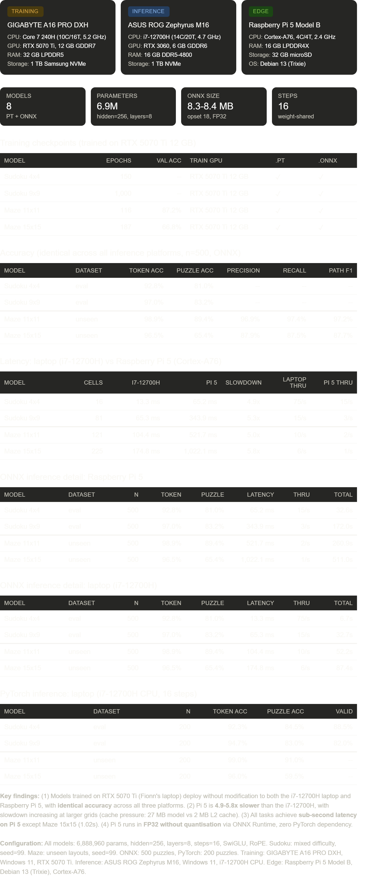

# Simplified Cross-Platform HRM for Puzzle-Solving

[](https://www.python.org/downloads/)
[](https://pytorch.org/)
[](https://onnx.ai/)
[](https://github.com/fionntmcc/cross-platform-hrm/actions)
[](https://github.com/psf/black)
[](LICENSE)
[](https://github.com/users/fionntmcc/projects/3)

A PyTorch implementation of the **Hierarchical Reasoning Model (HRM)**, a recurrent architecture that solves constraint-satisfaction puzzles by iteratively refining a hidden state rather than producing chain-of-thought text. The original HRM paper [[1]](#references) uses two coupled recurrent modules (a slow planner and a fast worker); a follow-up analysis by Ge, Liao and Poggio [[2]](#references) argues that the planner isn't actually doing much, and that a single L-module iterated to convergence reaches comparable accuracy while training ~2.4x faster. This project implements that simplified L-only variant, trains it on Sudoku and weighted mazes, and deploys the result to a Raspberry Pi 5 via ONNX Runtime.

This is our final year project for the B.Sc. (Hons) Computing in Software Development at **Atlantic Technological University**, supervised by **Dr. John Healy**.

- **Authors:** Kyrylo Kozlovskyi (G00425385), Fionn McCarthy (G00414386)

---

## Deliverables

| Deliverable | Location |
|---|---|
| Source code | `.github/workflows/`, `docs/`, `hrm/`, `scripts/`, `test/` |
| Dissertation — Kyrylo Kozlovskyi | [`docs/KyryloKozlovskyi_G00425385_Dissertation.pdf`](docs/KyryloKozlovskyi_G00425385_Dissertation.pdf) |
| Dissertation — Fionn McCarthy | [`docs/FionnMcCarthy_G00414386_Dissertation.pdf`](docs/FionnMcCarthy_G00414386_Dissertation.pdf) |
| Screencast | [Watch on SharePoint](https://atlantictu-my.sharepoint.com/:v:/g/personal/g00425385_atu_ie/IQAVylnvI9IGQIxUlFOU1z4hAd8WDMdaUBjWy_AE5wyWsXo?e=KmxAbq) · also available as `screencast.mp4` via [`docs/screencast_link.txt`](docs/screencast_link.txt) and the [latest release](https://github.com/fionntmcc/cross-platform-hrm/releases/latest) |
| Poster | [`docs/poster.pdf`](docs/poster.pdf) |
| Command reference | [`docs/commands.md`](docs/commands.md) |
| Pre-trained models and datasets | [GitHub Releases (v1.0.0)](https://github.com/fionntmcc/cross-platform-hrm/releases/tag/v1.0.0) — download the latest release for pre-trained `.pt` and `.onnx` models, evaluation datasets, and everything needed to run the demo |

---

## What it does

The model is a 6.9 M parameter transformer stack (8 blocks, hidden size 256, SwiGLU MLPs, RMSNorm, rotary position embeddings) that gets applied to the input 16 times in a row. The same weights are reused every step, so the effective computational depth is 128 layers for only 8 layers' worth of parameters. Gradients flow only through the last step (the "one-step approximation" from the Wang paper [[1]](#references)), which keeps memory constant regardless of how many reasoning steps you use.

One architecture handles three tasks:

- **4×4 Sudoku** — tiny, fast to train, used for sanity-checking the architecture.
- **9×9 Sudoku** — the headline task.
- **Weighted mazes** — a new benchmark we built that labels shortest paths over randomised edge weights using Dijkstra algorithm.

### Features

Beyond the model itself, the project includes:

- **Two generators** — unique-solution Sudoku (easy / medium / hard / mixed, difficulty is defined by number of backtracks required) and the weighted-maze generator.
- **Training pipeline** with mixed-precision, cosine LR schedule, deep supervision, and structured JSONL / CSV / TensorBoard logging.
- **ONNX export** that produces a static graph the dynamo exporter is happy with. The wrapper (`SimplifiedHRMForONNX`) hard-codes the puzzle type at construction, unrolls the 16-step loop into Python, swaps FlashAttention for plain attention, and pre-computes the RoPE tables. Every export runs a 5-input check against the PyTorch reference before the `.onnx` file is written.
- **`solve_onnx.py`** — pure numpy + onnxruntime, no PyTorch, no CUDA. Runs on anything including a Raspberry Pi.
- **Multi-seed runner** that trains the same config under several seeds and aggregates mean / std for dissertation tables.
- **Step-by-step visualisation** that replays the 16 reasoning iterations in the terminal so you can watch the grid converge.
- **Maze figures** via matplotlib, with predicted vs ground-truth path overlays.
- **GitHub Actions CI** (Black, Ruff, pytest on Python 3.10–3.13) and a release workflow for publishing trained checkpoints.
- **Model release scripts** for publishing to and downloading from GitHub Releases.

---

## Results



Full tables, multi-seed variance, ablations, and the Raspberry Pi 5 benchmarks are in the dissertations.

---

## Setup

### Prerequisites

- [**Python 3.10–3.13**](https://www.python.org/downloads/) — required for all usage
- [**Git**](https://git-scm.com/downloads) — to clone the repository
- [**GitHub CLI (`gh`)**](https://cli.github.com/) — optional, for downloading releases and publishing models

Training is much faster with a CUDA GPU. Our reference runs used an NVIDIA GPU, but everything in the repo also runs on CPU. Run all commands from the repository root.

### General setup

```bash
git clone https://github.com/fionntmcc/cross-platform-hrm.git
cd cross-platform-hrm

python -m venv .venv
source .venv/bin/activate              # Linux / macOS
# .\.venv\Scripts\Activate.ps1         # Windows PowerShell

python -m pip install --upgrade pip setuptools wheel
pip install -e .
```

This installs the runtime requirements: PyTorch, numpy, ONNX export dependencies, and the `hrm` package in editable mode.

### Downloading pre-trained models and datasets

Download everything from the [v1.0.0 release](https://github.com/fionntmcc/cross-platform-hrm/releases/tag/v1.0.0) manually, or using the GitHub CLI:

```bash
gh release download v1.0.0 --dir . --repo fionntmcc/cross-platform-hrm
```

Then place the files in the correct directories at the repository root:

- `.pt`, `.onnx`, `.onnx.data` files → `model/`
- `.npz` dataset files → `data/`

**Linux / macOS:**

```bash
mkdir -p model data
mv *.pt *.onnx *.onnx.data model/
mv *.npz data/
```

**Windows (PowerShell):**

```powershell
mkdir model, data
move *.pt model\
move *.onnx model\
move *.onnx.data model\
move *.npz data\
```

You should now have:

| Directory | Files |
|---|---|
| `model/` | `simplified_hrm_sudoku_4x4.pt`, `simplified_hrm_sudoku_4x4.onnx`, `simplified_hrm_sudoku_9x9.pt`, `simplified_hrm_sudoku_9x9.onnx`, `simplified_hrm_maze_11x11.pt`, `simplified_hrm_maze_11x11.onnx`, `simplified_hrm_maze_15x15.pt`, `simplified_hrm_maze_15x15.onnx` (plus `.onnx.data` files) |
| `data/` | `sudoku_4x4_eval.npz`, `sudoku_9x9_eval.npz`, `maze_11x11_unseen.npz`, `maze_15x15_unseen.npz` |

### Dev environment setup

For training, tests, linting, TensorBoard logging, and figure generation, install the dev extras:

```bash
pip install -e ".[dev]"
pre-commit install
```

That adds:

- `pytest` and `pytest-cov` for tests
- `black` and `ruff` for formatting and linting
- `matplotlib` for maze figures
- `tensorboard` for training logs
- `pre-commit` hooks matching CI

Useful validation commands after setup:

```bash
pytest
ruff check hrm test
black --check hrm test/hrm_test test/other
```

### ONNX-only inference setup (Raspberry Pi 5 / edge devices)

If you only want to run exported ONNX models and do not need PyTorch for training or export:

```bash
python -m venv .venv
source .venv/bin/activate

python -m pip install --upgrade pip
pip install numpy onnxruntime
```

No PyTorch, no CUDA, no build tools. ONNX Runtime has prebuilt aarch64 wheels so this installs in seconds on a Pi.

---

## Quick start

### 1. Clone and install

```bash
git clone https://github.com/fionntmcc/cross-platform-hrm.git
cd cross-platform-hrm

python -m venv .venv
source .venv/bin/activate              # Linux / macOS
# .\.venv\Scripts\Activate.ps1         # Windows PowerShell

pip install -e .
```

### 2. Download pre-trained models and datasets

Download everything from the [v1.0.0 release](https://github.com/fionntmcc/cross-platform-hrm/releases/tag/v1.0.0) manually, or using the GitHub CLI:

```bash
gh release download v1.0.0 --dir . --repo fionntmcc/cross-platform-hrm
```

Then place the files in the correct directories:

**Linux / macOS:**

```bash
mkdir -p model data
mv *.pt *.onnx *.onnx.data model/
mv *.npz data/
```

**Windows (PowerShell):**

```powershell
mkdir model, data
move *.pt model\
move *.onnx model\
move *.onnx.data model\
move *.npz data\
```

### 3. Run the demo

#### PyTorch evaluation (requires full install)

```bash
python scripts/run_simplified.py --model model/simplified_hrm_sudoku_4x4.pt --puzzle sudoku_4x4 --data data/sudoku_4x4_eval.npz

python scripts/run_simplified.py --model model/simplified_hrm_sudoku_9x9.pt --puzzle sudoku_9x9 --data data/sudoku_9x9_eval.npz

python scripts/run_simplified.py --model model/simplified_hrm_maze_11x11.pt --puzzle maze --data data/maze_11x11_unseen.npz

python scripts/run_simplified.py --model model/simplified_hrm_maze_15x15.pt --puzzle maze --data data/maze_15x15_unseen.npz
```

#### ONNX evaluation (no PyTorch needed)

```bash
python scripts/solve_onnx.py --model model/simplified_hrm_sudoku_4x4.onnx --puzzle sudoku_4x4 --data data/sudoku_4x4_eval.npz

python scripts/solve_onnx.py --model model/simplified_hrm_sudoku_9x9.onnx --puzzle sudoku_9x9 --data data/sudoku_9x9_eval.npz

python scripts/solve_onnx.py --model model/simplified_hrm_maze_11x11.onnx --puzzle maze --maze-size 11 --data data/maze_11x11_unseen.npz

python scripts/solve_onnx.py --model model/simplified_hrm_maze_15x15.onnx --puzzle maze --maze-size 15 --data data/maze_15x15_unseen.npz
```

#### Maze visualiser (publication-quality figures)

```bash
python scripts/visualise_maze.py --model model/simplified_hrm_maze_11x11.pt --data data/maze_11x11_unseen.npz --num 5 --save-dir figures/maze_11x11 --show

python scripts/visualise_maze.py --model model/simplified_hrm_maze_15x15.pt --data data/maze_15x15_unseen.npz --num 5 --save-dir figures/maze_15x15 --show

python scripts/visualise_maze.py --model model/simplified_hrm_maze_11x11.pt --data data/maze_11x11_unseen.npz --steps --index 0 --save-dir figures/maze_11x11_steps --show
```

#### Step-by-step Sudoku reasoning (terminal)

```bash
python scripts/visualise_simplified.py --model model/simplified_hrm_sudoku_9x9.pt --puzzle sudoku_9x9 --delay 0.3
```

#### Latency benchmarks

```bash
python scripts/solve_onnx.py --model model/simplified_hrm_sudoku_4x4.onnx --puzzle sudoku_4x4 --benchmark

python scripts/solve_onnx.py --model model/simplified_hrm_sudoku_9x9.onnx --puzzle sudoku_9x9 --benchmark

python scripts/solve_onnx.py --model model/simplified_hrm_maze_11x11.onnx --puzzle maze --maze-size 11 --benchmark

python scripts/solve_onnx.py --model model/simplified_hrm_maze_15x15.onnx --puzzle maze --maze-size 15 --benchmark
```

---

## Training from scratch

If you want to train your own models instead of using the pre-trained ones. Training hyperparameters match those reported in the dissertation (1,000 training examples, 200 epochs, cosine annealing, AMP):

```bash
# Sudoku 4x4
python scripts/train_simplified.py --puzzle sudoku_4x4 --generate-data --num-samples 1000 --difficulty mixed --epochs 200 --batch-size 512 --lr 3e-4 --weight-decay 0.1 --amp --run-name sudoku_4x4

# Sudoku 9x9
python scripts/train_simplified.py --puzzle sudoku_9x9 --generate-data --num-samples 1000 --difficulty mixed --epochs 200 --batch-size 512 --lr 3e-4 --weight-decay 0.1 --amp --run-name sudoku_9x9

# Maze 11x11
python scripts/train_simplified.py --puzzle maze --generate-data --num-samples 1000 --maze-size 11 --epochs 200 --batch-size 128 --lr 3e-4 --weight-decay 0.1 --amp --run-name maze_11x11

# Maze 15x15
python scripts/train_simplified.py --puzzle maze --generate-data --num-samples 1000 --maze-size 15 --epochs 200 --batch-size 128 --lr 3e-4 --weight-decay 0.1 --amp --run-name maze_15x15
```

Each run writes `..._best.pt`, `..._final.pt`, and `training_history_*.json` into `model/`. If you already have `.npz` training data, replace `--generate-data` with `--data-path path/to/file.npz`.

---

## ONNX export and inference

Export a trained checkpoint to ONNX and then benchmark or evaluate it with ONNX Runtime.

```bash
# Export (requires PyTorch). Verifies against PyTorch automatically (5/5 must pass).
python scripts/export_onnx.py --model model/simplified_hrm_sudoku_9x9.pt --puzzle sudoku_9x9

python scripts/export_onnx.py --model model/simplified_hrm_maze_15x15.pt --puzzle maze --maze-size 15

# Run (numpy + onnxruntime only, no PyTorch)
python scripts/solve_onnx.py --model model/simplified_hrm_sudoku_9x9.onnx --puzzle sudoku_9x9

# Evaluate on a dataset
python scripts/solve_onnx.py --model model/simplified_hrm_sudoku_9x9.onnx --puzzle sudoku_9x9 --data data/sudoku_9x9_eval.npz

# Latency benchmark
python scripts/solve_onnx.py --model model/simplified_hrm_sudoku_9x9.onnx --puzzle sudoku_9x9 --benchmark
```

The default opset is 18 (not 17). PyTorch's dynamo-based exporter needs it; opset 17 fails with a down-conversion error.

`export_onnx.py` automatically verifies the exported graph against the PyTorch checkpoint before writing the `.onnx` file. The `SimplifiedHRMForONNX` wrapper resolves six ONNX-incompatible patterns: baking the puzzle type enum, unrolling the reasoning loop, forcing standard attention, pre-computing RoPE buffers, selecting the correct output head, and resolving prediction feedback (on for Sudoku, off for maze).

---

## Raspberry Pi 5 deployment

The cross-platform bit: train on a GPU, export once, run the same `.onnx` file on any CPU.

```bash
# On the Pi
sudo apt update && sudo apt install -y python3-pip python3-venv git
python3 -m venv ~/hrm-env && source ~/hrm-env/bin/activate && pip install numpy onnxruntime
git clone https://github.com/fionntmcc/cross-platform-hrm.git && cd cross-platform-hrm

# Download models and datasets from GitHub Releases
gh release download v1.0.0 --dir . --repo fionntmcc/cross-platform-hrm
mkdir -p model data && mv *.pt *.onnx *.onnx.data model/ && mv *.npz data/

# Or copy from your laptop instead
# scp model/*.onnx data/*.npz pi@<pi-ip>:~/cross-platform-hrm/

# Benchmark
python scripts/solve_onnx.py --model model/simplified_hrm_sudoku_9x9.onnx --puzzle sudoku_9x9 --benchmark

# Evaluate
python scripts/solve_onnx.py --model model/simplified_hrm_sudoku_9x9.onnx --puzzle sudoku_9x9 --data data/sudoku_9x9_eval.npz
```

No PyTorch, no CUDA, no cross-compilation. ONNX Runtime picks up NEON SIMD on ARM automatically. Same weights, same outputs (verified to 5 decimal places at export time).

---

## Dataset generation

Everything is generated inside the environment, no downloads necessary.

```bash
# Sudoku (JSON / CSV output)
python -m hrm.data.generate_dataset sudoku --size 9 --num 10000 --difficulty mixed --seed 123 --output data/sudoku_9x9_train.json

# Maze (JSON / CSV output)
python -m hrm.data.generate_dataset maze --size 15 --num 5000 --seed 123 --output data/maze_15x15_train.json

# Sudoku (.npz format, consumed directly by run_simplified.py)
python hrm/data/sudoku_generator.py --size 9 --num 10000 --difficulty mixed --seed 123 --output data/sudoku_9x9_train
```

Every Sudoku puzzle is validated to have a unique solution. Mazes are paired with their shortest weighted path (Dijkstra) as a binary mask.

---

## Multi-seed runs

For honest error bars in the dissertation:

```bash
# Train across 3 seeds
python scripts/run_seeds.py --puzzle sudoku_9x9 --generate-data --num-samples 1000 --difficulty mixed --epochs 200 --batch-size 512 --lr 3e-4 --weight-decay 0.1 --amp --seed-list 123 456 789 --output-dir model/seed_experiment

# Just re-aggregate without re-training
python scripts/run_seeds.py --puzzle sudoku_9x9 --aggregate-only --output-dir model/seed_experiment
```

Output: `seed_summary_<puzzle>.json` and `seed_comparison_<puzzle>.png` with per-seed curves, mean ± std bands, and a variance flag that trips if any accuracy metric goes over 1.5 %.

---

## Tests

```bash
pytest

pytest --cov=hrm --cov-report=term-missing

pytest test/hrm_test/test_simplified_hrm.py -v
```

Tests live under `test/hrm_test/` (core package) and `test/other/` (data layer). CI runs the whole thing on Python 3.10 through 3.13.

---

## Dev

Pre-commit runs Black and Ruff before every commit, matching what CI does:

```bash
pip install pre-commit && pre-commit install

pre-commit run --all-files
```

Manual:

```bash
black hrm/ test/hrm_test/ test/other/

ruff check --fix hrm/ test/hrm_test/ test/other/
```

---

## Command reference

A full CLI reference for every script (flags, defaults, examples) is available at [`docs/commands.md`](docs/commands.md).

---

## References

The architecture and training procedure follow these two papers. Full bibliographies (RoPE, SwiGLU, RMSNorm, ONNX Runtime, and supporting work) are in each dissertation.

[1] G. Wang, J. Li, Y. Sun, X. Chen, C. Liu, Y. Wu, M. Lu, S. Song, and Y. Abbasi Yadkori, *"Hierarchical Reasoning Model,"* arXiv preprint [arXiv:2506.21734](https://arxiv.org/abs/2506.21734), 2025. Reference code: <https://github.com/sapientinc/HRM>.

[2] R. Ge, Q. Liao, and T. Poggio, *"Hierarchical Reasoning Models: Perspectives and Misconceptions,"* arXiv preprint [arXiv:2510.00355](https://arxiv.org/abs/2510.00355), 2025. Motivates the L-module-only simplification we implement here.

---

## Authors

**Kyrylo Kozlovskyi** (G00425385) — Simplified HRM (L-module only), ONNX export pipeline (`export_onnx.py`), zero-dependency inference (`solve_onnx.py`), Raspberry Pi 5 deployment, GitHub Actions CI/CD, model release scripts (`download_model.py`, `publish_models.py`).

**Fionn McCarthy** (G00414386) — Full HRM reference implementation, weighted-maze generator and task design, training pipeline, metrics / logger modules, multi-seed analysis, Sudoku generator.

Supervised by Dr. John Healy (Department of Computer Science & Applied Physics, ATU Galway). Thanks to Sapient Intelligence for open-sourcing the original HRM code, and to Ge, Liao and Poggio for the follow-up analysis that pointed us at the L-module-only variant.

---

## License

MIT — see [LICENSE](LICENSE). If you build on this for academic work, please also cite Wang et al. [[1]](#references) and Ge, Liao and Poggio [[2]](#references).
